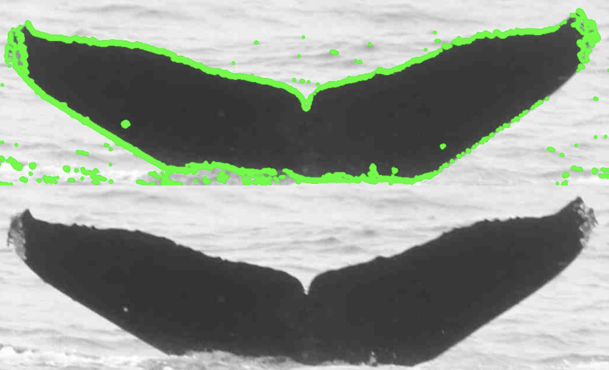

# Whale Identification Model

## Repository Description

### A. Topic description
Nowadays, whale is really rare and protecting whale is necessary. Different species of whales have different features in their shape of tails and special markings. Thus, in many cases, scientists monitor whales’ activities by using photos of their tails. To help scientists confirm the species of different whales in huge number of photos and save their time, we aim to build a new machine learning model to do this instead of persons.<br />

### B. Data sources
Most of datas comes from [Happy Whale](https://happywhale.com) and sorted by [Kaggle](https://www.kaggle.com), a platform which already use image process algorithms to category photos collected from public and various survey.<br />
[**Dataset of this project.**](https://www.kaggle.com/c/whale-categorization-playground/data)

### C. Algorithms are being used and best of public kernals
Since the competition has no award and participants have no responsibility to pubilc their code, limited kernels are available. For most of public kernels, they just try to input data, resize photos and make color channels identical — even it means it may lose some information of colored photos.<br />
Some kernels made further research. For instance, some would use constructed [CNN model to finish the initial identification](https://www.kaggle.com/sunnybeta322/what-am-i-whale-let-me-tell-you). Other use self-developed [triplet model](https://www.kaggle.com/CVxTz/beating-the-baseline-keras-lb-0-38) and it performs better than general CNN model. They beat the baseline of the competition and reached 46.821% accuracy, which seems worth to make some further research. Recently, another participant shared a [traidiional cnn model](https://www.kaggle.com/gimunu/data-augmentation-with-keras-into-cnn) with 32.875% accuracy, implement the CNN model which is different from us.<br />

### D. Evaluating the success of the model
The success of the model will be evaluated based on the accuracy of the model could achieve. The host of the competition will provide one or more test set for participants to evaluate and improve the model. What we need to do is to construct, test and improve the model based on the result we get.<br />


### E. Main model of the project
1. [traditional CNN model with relative few layers](https://github.com/ZiyaoQiao/INFO7390_FinalProject/tree/master/Basic%20Model)<br />
2. [pretrained model(including InceptionV3, Resnet50, VGG16)](https://github.com/ZiyaoQiao/INFO7390_FinalProject/blob/master/Pretrained%20Model/TransferLearning.py)<br />
<br />

### F. Project Process Description -- Basic CNN Model
#### *Before use, please make sure you download the Dataset, edit the input path in the code correctly and install all necessary packages.*
[**Dataset of this project.**](https://www.kaggle.com/c/whale-categorization-playground/data)

*Main python packages we need for this project: os, sys, argparse, seaborn, math, glob, matplotlib, PIL, sklearn, keras with Tensorflow backend, pandas, shutil, cv2*

#### F(1) Detect the contour of the tail
We also write a function which could figure out apparent contour in one photo, which could highlighted the shape of the tail in some cases. We would generate a brand new dataset based on this algotithm and use models to learn this dataset.

```python
# for individual picture
# originpath: Absolute path or relative path of the Data file, based on the position of your program
# please take care of the indent because it represent the logic of a "if" or "for" iteration in Python

originPath = 'Datas/train/'  #Relative path

targetPath = '/Users/royn/INFO 7390/INFO7390_FinalProject/Datas/contourDetected_train/'   #Absolute path

g = os.walk(originPath)
for path,d,filelist in g:
    for filename in filelist:
        if filename.endswith('jpg'):

            img = cv2.imread(originPath+filename)

            gray = cv2.cvtColor(img, cv2.COLOR_BGR2GRAY)

            gradX = cv2.Sobel(gray, ddepth=cv2.CV_32F, dx=1, dy=0, ksize=3)
            gradY = cv2.Sobel(gray, ddepth=cv2.CV_32F, dx=0, dy=1, ksize=3)

            # subtract the y-gradient from the x-gradient
            gradient = cv2.subtract(gradX, gradY)
            gradient = cv2.convertScaleAbs(gradient)
            (_, thresh) = cv2.threshold(gradient, 100, 255, cv2.THRESH_BINARY)

            thresh = cv2.dilate(thresh, None, iterations=1)
            thresh = cv2.dilate(thresh, None, iterations=1)
            thresh = cv2.erode(thresh, None, iterations=1)
            thresh = cv2.erode(thresh, None, iterations=1)

            image, contours, hierarchy = cv2.findContours(thresh, cv2.RETR_TREE,
                                                          cv2.CHAIN_APPROX_SIMPLE)  # use cv2.RETR_TREE to locate and lock the tail
            img = cv2.drawContours(img, contours, -1, (0, 255, 0), 5)

            canny_edges = cv2.Canny(img, 300, 300)
            plt.imshow(canny_edges)

            cv2.imwrite(targetPath + filename, img, [int(cv2.IMWRITE_JPEG_QUALITY), 95])

            # return photo with highlighted edges
            canny_edges = cv2.Canny(img, 300, 300)
            plt.imshow(canny_edges)
            cv2.imwrite(targetPath + filename, img, [int(cv2.IMWRITE_JPEG_QUALITY), 95])
```

 
**Sample of results.**

#### F(2) Make photos Black and White, resize the photo
Since some of photos in the datast is gray and White as well as others are colored, in the basic CNN model, we use an existing function and make all the photos in the dataset Black-and-White, try to decrease the noises generated by colors, even it also indicates we will lose some useful information in some cases.

```python
def ImportImage(filename):
img = Image.open(filename).convert("LA").resize((SIZE,SIZE))
return np.array(img)[:,:,0]
train_img = np.array([ImportImage(img) for img in train_images])
```

#### F(3) Data preprocessing and augmentation
We have limited data in the dataset, and many classes have only one or two photos, so it is unwise to split part of data in the dataset as the internal test set. 

```python
#use of an image generator for preprocessing and data augmentation
x = x.reshape((-1,SIZE,SIZE,1))
input_shape = x[0].shape
x_train = x.astype("float32")
y_train = y_cat

image_gen = ImageDataGenerator(
    featurewise_center=True,
    featurewise_std_normalization=True,
    rotation_range=15,
    width_shift_range=.15,
    height_shift_range=.15,
    horizontal_flip=True)
```


#### F(4) Label Hot Encoder
Since the dataset is not sequential, we need to set label in every pictures for the model to enact deep learning. 

```python
class LabelOneHotEncoder():
    def __init__(self):
        self.ohe = OneHotEncoder()
        self.le = LabelEncoder()
    def fit_transform(self, x):
        features = self.le.fit_transform( x)
        return self.ohe.fit_transform( features.reshape(-1,1))
    def transform( self, x):
        return self.ohe.transform( self.la.transform( x.reshape(-1,1)))
    def inverse_tranform( self, x):
        return self.le.inverse_transform( self.ohe.inverse_tranform( x))
    def inverse_labels( self, x):
        return self.le.inverse_transform(x)

```

#### F(5) Plot Images 
A function for us in developing, to watch the dataset again before we train.

```python
def plotImages(images_arr, n_images=4):
    fig, axes = plt.subplots(n_images, n_images, figsize=(12,12))
    axes = axes.flatten()
    for img, ax in zip( images_arr, axes):
        if img.ndim != 2:
            img = img.reshape((SIZE,SIZE))
        ax.imshow( img, cmap="Greys_r")
        ax.set_xticks(())
        ax.set_yticks(())
    plt.tight_layout()

```

#### F(6) Assist functions 
We also set some assistant function for our model, set up the training set, visualize image if necessary and construct the class weights. In this way, we could set class label of image as index and we could also devide photos in each step equally.

```python
#constructing class weights
WeightFunction = lambda x : 1/x**0.75
ClassLabel2Index = lambda x : lohe.le.inverse_tranform( [[x]])
CountDict = dict(train_df["Id"].value_counts())
class_weight_dic = {lohe.le.transform([image_name])[0]: WeightFunction(count) for image_name, count in CountDict.items()}

#training the image preprocessing
image_gen.fit(x_train, augment=True)

#visualization of some images out of the preprocessing
augmented_images, _ = next( image_gen.flow( x_train, y_train.toarray(), batch_size=4*4))

```

#### F(7) Convolution Nerual Network Model
After many different try, we finally worked out a CNN model with highest cost-interest ratio. This model have 3 convolutional layers, with several dropout layers, flatten layers and dense layers to reshape the data and catch features. We set batchsize as 128 and step value is total number of the training set devided by batchsize, in this way we could make sure every photo in the dataset could be iterated once in a single epoch. Initially, we set the model run in small epochs like 10 to run in relative low costs. However, more epochs could be added if someone have better machine. In the end, we increase the epochs up to 100.<br/>
Besides, we added callback function in the model, you could set up the functions and check results by using Tensorboard.

```python
batch_size = 128
num_classes = len(y_cat.toarray()[0])
epochs = 100

model = Sequential()
model.add(Conv2D(48, kernel_size=(3, 3),
                 activation='relu',
                 input_shape=input_shape))
model.add(Conv2D(48, (3, 3), activation='sigmoid'))
model.add(MaxPooling2D(pool_size=(2, 2)))
model.add(Conv2D(48, (5, 5), activation='sigmoid'))
model.add(MaxPooling2D(pool_size=(3, 3)))
model.add(Dropout(0.33))
model.add(Flatten())
model.add(Dense(36, activation='sigmoid'))
model.add(Dropout(0.33))
model.add(Dense(36, activation='sigmoid'))
model.add(Dense(num_classes, activation='softmax'))

model.compile(loss=keras.losses.categorical_crossentropy,
              optimizer=keras.optimizers.Adadelta(),
              metrics=['accuracy'])
model.summary()
model.fit_generator(image_gen.flow(x_train, y_train.toarray(), batch_size=batch_size),
          steps_per_epoch=  x_train.shape[0]//batch_size,
          epochs=epochs,
          verbose=1,
          class_weight=class_weight_dic)
```

### G. Project Process Description -- Pretrained Model

#### *Before use, please make sure you download the Dataset, edit the input path in the code correctly and install all necessary packages.*

#### *Please setup a Machine with advanced GPU to used those pretrained models, if you run those model without such a machine, it would take a really long time to run, be interrupted easily and damage the machine seriously.*

#### *Why we suggest not to use Jupyter Notebook to run this project?<br/> Jupyter Notebook will not release GPU-Memory after computation unless you kill whole kernel, which is fatal for the speed of computing in our project. [Refer to similar problems.](https://discuss.pytorch.org/t/memory-is-not-released-in-jupyter-after-keyboardinterrupt/6757)*

#### *We strongly suggest readers to run pretrained models in terminal with CUDA-GPU, and set file directory before running so that the CPU and GPU could concentrate most of resources in the calcultating process.*

#### G(1) Split photo with different ID to different files
``` python
import pandas as pd
from glob import glob
import os
from shutil import copyfile,rmtree

train_images = glob("Datas/train/*jpg")
test_images = glob("Datas/test/*jpg")
df = pd.read_csv("Datas/train.csv")

ImageToLabelDict = dict( zip( df["Image"], df["Id"]))
df["Image"].head()

new_data_folder ='keras/train/'
if(os.path.exists(new_data_folder)):
    rmtree(new_data_folder)

def save_images(df,ImageToLabelDict):
    for key in df["Image"]:
        image_class = ImageToLabelDict[key]
        img_full_path = new_data_folder + image_class + '/' + key
        img_class_path = new_data_folder + image_class
        if not os.path.exists(img_class_path):
            os.makedirs(img_class_path)
        copyfile("Datas/train/"+key, img_full_path)

save_images(df, ImageToLabelDict)
```


#### G(2) Train without "New_whale" class
Since the category "New_Whale" is an ambiguous category, contain a lot of photos(more than 800) with various features, which would lead a large amount of noise, so in some of our model, we train the model without this category. All we need to do is just findout the output filepath in the last part and delete the "new-whale" folder.

#### G(3) Set up attributes
**Different model have different size requirement, for InceptionV3 is 224x224, for ResNet50 we keep the same, but for VGG19 we change it to 299x299.**

```python
IM_WIDTH, IM_HEIGHT = 224, 224  # fixed size for InceptionV3
NB_EPOCHS = 60
BAT_SIZE = 32
FC_SIZE = 1024
NB_IV3_LAYERS_TO_FREEZE = 172
```

#### G(4) Get number of files

```python
def get_nb_files(directory):
    """Get number of files by searching directory recursively"""
    if not os.path.exists(directory):
        return 0
    cnt = 0
    for r, dirs, files in os.walk(directory):
        for dr in dirs:
            cnt += len(glob(os.path.join(r, dr + "/*")))
    return cnt
```

#### G(5) Set up transfer learning process

```python
setup_to_transfer_learn(model, base_model):
    """Freeze all layers and compile the model"""
    for layer in base_model.layers:
        layer.trainable = False
    model.compile(optimizer='rmsprop', loss='categorical_crossentropy', metrics=['accuracy'])

```


#### G(6) Triplet loss function

```python
def triplet_loss(y_true, y_pred):
    y_pred = K.l2_normalize(y_pred, axis=1)
    batch = BAT_SIZE
    # print(batch)
    ref1 = y_pred[0:batch, :]
    pos1 = y_pred[batch:batch + batch, :]
    neg1 = y_pred[batch + batch:3 * batch, :]
    dis_pos = K.sum(K.square(ref1 - pos1), axis=1, keepdims=True)
    dis_neg = K.sum(K.square(ref1 - neg1), axis=1, keepdims=True)
    dis_pos = K.sqrt(dis_pos)
    dis_neg = K.sqrt(dis_neg)
    a1 = 0.6
    d1 = dis_pos + K.maximum(0.0, dis_pos - dis_neg + a1)
    return K.mean(d1)

```

#### G(7) Freeze the bottom NB-IV3-LAYERS and retrain the remaining top layers(Only use for Inception V3 Model)

NB-IV3-LAYERS Corresponds to the top 2 inception blocks in the inceptionv3 architecture, hides some layer and leave others train, to figure out features more clearly.

```python
def setup_to_finetune(model):
    for layer in model.layers[:NB_IV3_LAYERS_TO_FREEZE]:
        layer.trainable = False
    for layer in model.layers[NB_IV3_LAYERS_TO_FREEZE:]:
        layer.trainable = True
    model.compile(optimizer=SGD(lr=0.0001, momentum=0.9), loss='categorical_crossentropy', metrics=['accuracy'])

```

#### G(8) Set the transfer learning process

Use transfer learning and fine-tuning to train a network on a new dataset.<br/>
**In "set up model" part, choose the transfer learning model you need. Before use, please check attributes we entered before since different model have different requirements in some attributes such as the size of input pictures.**

```python
def train(args):
    """Use transfer learning and fine-tuning to train a network on a new dataset"""
    nb_train_samples = get_nb_files(args.train_dir)
    nb_classes = len(glob(args.train_dir + "/*"))
    nb_val_samples = get_nb_files(args.val_dir)
    nb_epoch = int(args.nb_epoch)
    batch_size = int(args.batch_size)

    # data prep
    train_datagen = ImageDataGenerator(
        preprocessing_function=preprocess_input,
        rotation_range=30,
        width_shift_range=0.2,
        height_shift_range=0.2,
        shear_range=0.2,
        zoom_range=0.2,
        horizontal_flip=True
    )
    test_datagen = ImageDataGenerator(
        preprocessing_function=preprocess_input,
        rotation_range=30,
        width_shift_range=0.2,
        height_shift_range=0.2,
        shear_range=0.2,
        zoom_range=0.2,
        horizontal_flip=True
    )

    train_generator = train_datagen.flow_from_directory(
        args.train_dir,
        target_size=(IM_WIDTH, IM_HEIGHT),
        batch_size=batch_size
    )
    validation_generator = test_datagen.flow_from_directory(
        args.val_dir,
        target_size=(IM_WIDTH, IM_HEIGHT),
        batch_size=batch_size
    )

    # setup model
    # base_model using Inception V3
    # base_model = InceptionV3(weights='imagenet', include_top=False)  # include_top=False excludes final FC layer

    # base_model using ResNet50
    # base_model = ResNet50(weights='imagenet', include_top=False, input_tensor=Input(shape=(224, 224, 3)))

    # base_model using VGG19
    base_model = VGG19(include_top=False, weights='imagenet',input_tensor=None, input_shape=None,pooling=None)

    model = add_new_last_layer(base_model, nb_classes)

    # transfer learning
    setup_to_transfer_learn(model, base_model)
    
    
	#fit the model and return the result of the training process
    history_tl = model.fit_generator(
        train_generator,
        steps_per_epoch=train_generator.n / train_generator.batch_size,
        epochs=nb_epoch,
        validation_data=validation_generator,
        validation_steps=validation_generator.n / validation_generator.batch_size,
        class_weight='balanced',
        verbose=1,
        callbacks=[TensorBoard(log_dir='.\\keras\\tmp\\log\\', write_graph=True)])

    # fine-tuning
    setup_to_finetune(model)

    history_ft = model.fit_generator(
        train_generator,
        steps_per_epoch=train_generator.n / train_generator.batch_size,
        epochs=nb_epoch,
        validation_data=validation_generator,
        validation_steps=validation_generator.n / validation_generator.batch_size,
        class_weight='balanced',
        verbose=1,
        callbacks=[TensorBoard(log_dir='.\\keras\\tmp\\log\\', write_graph=True)])
    
    
	 #save the well-trained model
    model.save(args.output_model_file) 

    if args.plot:
        plot_training(history_ft)
```

#### G(9) plot the result in Tensorboard
```python
def plot_training(history):
    acc = history.history['acc']
    val_acc = history.history['val_acc']
    loss = history.history['loss']
    val_loss = history.history['val_loss']
    epochs = range(len(acc))

    plt.plot(epochs, acc, 'r.')
    plt.plot(epochs, val_acc, 'r')
    plt.title('Training and validation accuracy')

    plt.figure()
    plt.plot(epochs, loss, 'r.')
    plt.plot(epochs, val_loss, 'r-')
    plt.title('Training and validation loss')
    plt.show()
```

#### G(10) Initialize the model

All set, let's start training!

```python
if __name__ == "__main__":
    a = argparse.ArgumentParser()
    a.add_argument("--train_dir", default=".\\keras\\train\\")
    a.add_argument("--val_dir", default=".\\keras\\test\\")
    a.add_argument("--nb_epoch", default=NB_EPOCHS)
    a.add_argument("--batch_size", default=BAT_SIZE)
    a.add_argument("--output_model_file", default="vgg16-transfer-ver1.model")
    a.add_argument("--plot", action="store_true")

    args = a.parse_args()
    if args.train_dir is None or args.val_dir is None:
        a.print_help()
        sys.exit(1)

    if (not os.path.exists(args.train_dir)) or (not os.path.exists(args.val_dir)):
        print("directories do not exist")
        sys.exit(1)

    train(args)
```

### H. Project Process Description -- Return the results
```python
train_images = glob(".\\input\\train\\*jpg")
test_images = glob(".\\input\\test\\*jpg")
df = pd.read_csv(".\\input\\train.csv")

df["Image"] = df["Image"].map(lambda x: ".\\input\\train\\" + x)
ImageToLabelDict = dict(zip(df["Image"], df["Id"]))
SIZE = 224


def ImportImage(filename):
    img = Image.open(filename).convert("LA").resize((SIZE, SIZE))
    return np.array(img)[:, :, 0]


class LabelOneHotEncoder():
    def __init__(self):
        self.ohe = OneHotEncoder()
        self.le = LabelEncoder()

    def fit_transform(self, x):
        features = self.le.fit_transform(x)
        return self.ohe.fit_transform(features.reshape(-1, 1))

    def transform(self, x):
        return self.ohe.transform(self.la.transform(x.reshape(-1, 1)))

    def inverse_tranform(self, x):
        return self.le.inverse_transform(self.ohe.inverse_tranform(x))

    def inverse_labels(self, x):
        return self.le.inverse_transform(x)

#preprocess photos just as what we had done in training process, ensure the testing quality
y = list(map(ImageToLabelDict.get, train_images))
lohe = LabelOneHotEncoder()
y_cat = lohe.fit_transform(y)

image_gen = ImageDataGenerator(
    # featurewise_center=True,
    # featurewise_std_normalization=True,
    rescale=1. / 255,
    rotation_range=15,
    width_shift_range=.15,
    height_shift_range=.15,
    horizontal_flip=True)

model = load_model(".\\vgg16-transfer-ver1.model")
model.load_weights(".\\vgg16-transfer-ver1.model")
target_size = (224, 224)

def predict(model, img, target_size):
    """Run model prediction on image
    Args:
      model: keras model
      img: PIL format image
      target_size: (w,h) tuple
    Returns:
      list of predicted labels and their probabilities
    """
    if img.size != target_size:
        img = img.resize(target_size)

    x = image.img_to_array(img)
    x = np.expand_dims(x, axis=0)
    x = preprocess_input(x)
    preds = model.predict(x)
    return preds
    
with open("sample_submission.csv", "w") as f:
    with warnings.catch_warnings():
        f.write("Image,Id\n")
        warnings.filterwarnings("ignore", category=DeprecationWarning)
        for images in test_images:
            img = Image.open(images)
            img = img.convert("L")
            img = img.convert("RGB")
            y = predict(model, img, target_size)
            predicted_args = np.argsort(y)[0][::-1][:5]
            predicted_tags = lohe.inverse_labels(predicted_args)
            images = split(images)[-1]
            predicted_tags = " ".join(predicted_tags)
            # if the model is trained without the new_whale class
            # predicted_tags = "new_whale " + predicted_tags
            f.write("%s,%s\n" % (images, predicted_tags))
```


### I. Results

| Method        | Accuracy in test set                         | Epochs                         | Average time (s/per epoch)    |
| ------------- | ---------------------------- | ----                  |------------------------------------------------ |
| ResNet50 without 'NewWhale'            | 32.482%                  | 10                 | 12478s|
| ResNet50 with 'NewWhale'            | 32.631%                  | 10                   | 12600s|
| VGG19 with 'NewWhale'            | 32.999%                  | 30                   | 2270s|
| inceptionV3 without 'NewWhale'            | 32.481%                  | 20                   | 4703s|
| CNN Model with contour detected            | 32.763%                  | 100                   | 215s|
| CNN Model without contour detected            | 32.875%                  | 100                   | 214s|

### J. Conclusion
1. In conclusion, the basic CNN model seems too easy for the dataset and it could not figure out too many features from the training set. Besides, since many class in the dataset have only one or two picture, so the weight of features from single photo could be really large and have negative influence to the result.<br/>
2. However, even different models we implemented have tiny difference, totally they performed similar for this dataset and the score in the test set not have large difference. As we summarized, that’s mainly because of the low quality of the dataset: nearly every pictures have different size, some photos is colorful but others not, and the photos obtained from different direction, different distance and environment, which is also consider and captured as a part of features by the models.


### K. References
1. https://www.coursera.org/learn/neural-networks-deep-learning<br/>
2. https://papers.nips.cc/paper/4824-imagenet-classification-with-deep-convolutional-neural-networks.pdf<br/>
3. https://arxiv.org/abs/1512.03385<br/>
4. https://en.wikipedia.org/wiki/Humpback_whale<br/>
5. https://cs231n.github.io<br/>

### L.License (MIT)
These tutorials and source-code are published under the [MIT License](https://github.com/ZiyaoQiao/INFO7390_FinalProject/blob/master/LICENSE) which allows very broad use for both academic and commercial purposes.<br />

A few of the images used for demonstration purposes may be under copyright. These images are included under the "fair usage" laws.<br />

You are very welcome to modify these tutorials and use them in your own projects, but please keep a link to the [original repository](https://github.com/ZiyaoQiao/INFO7390_FinalProject).<br />
